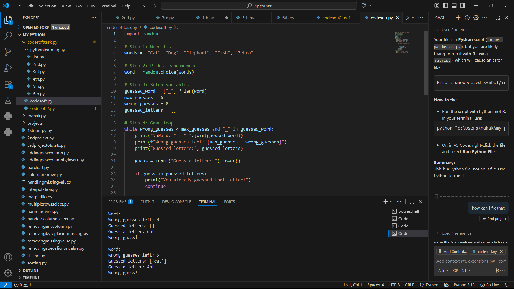

# codeaplha_tasks
# 🎮 Hangman Game (Python)


A simple *text-based Hangman Game* built in Python as part of my internship task.  
The player tries to guess a randomly chosen word, one letter at a time, with a limit of 6 incorrect guesses.

---

## 🚀 Features
- Uses a small list of 5 predefined words.
- Tracks correct and incorrect guesses.
- Maximum of 6 wrong attempts allowed.
- Displays guessed letters and word progress.
- Console-based, no graphics or audio.

---

## 🛠 Technologies Used
- Python 3
- Random module
- While loops, if-else conditions
- Strings and lists

---

## 📦 How to Run

1. Clone this repository:
   ```bash
   git clone https://github.com/your-Mahak19m/codealpha_tasks.git
2. Navigation into the project folder:
     ```bash
   cd codealpha_tasks
3. Run the game:
  ```bash
   python hangman.py

 ---

## 📸 Demo
Here’s a screenshot of the Hangman game running:


